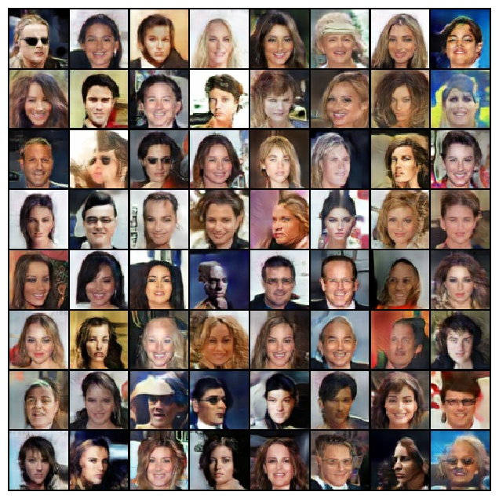
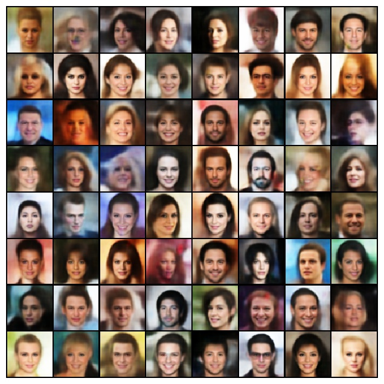
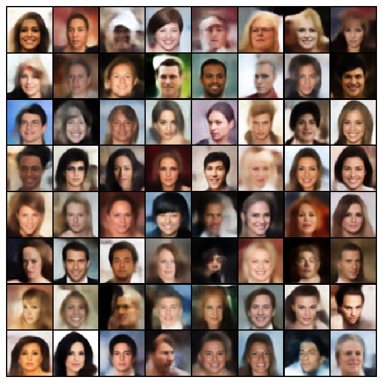

# PyTorch Generative Model
Pytorch implementation of several generative model.

## Requirement
- python 3.6
- pytorch >= 1.0.0
- torchvision
- numpy

## Datasets
Download the ```img_align_celeba.zip``` from [here](https://drive.google.com/drive/folders/0B7EVK8r0v71pTUZsaXdaSnZBZzg) and extract to ```datasets\celeba\img_align_celeba```

## Models
### Generative Adversarial Network
```
python dcgan.py
```


### Variational Autoencoder
```
python vae.py
```


### Adversarial Autoencoder
```
python aae.py
```

